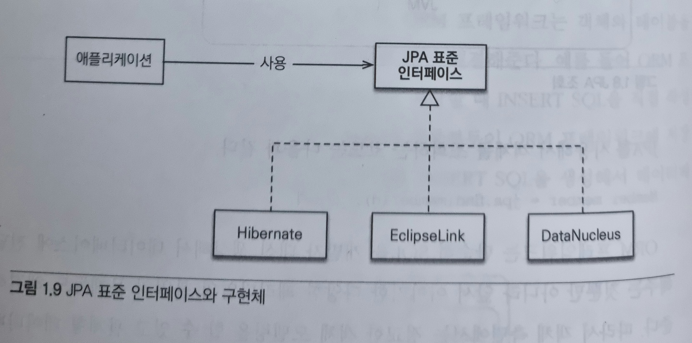

# 01장

## JPA(Java Persistance API)

JPA(Java Persistance API)는 자바 진영의 ORM 기술 표준이다.

 

### ORM(Object-Relational Mapping)
그렇다면 ORM이란 무엇일까? ORM(Object-Relational Mapping)은 이름 그대로 객체와 관계형 데이터베이스를 매핑한다는 뜻이다. ORM 프레임워크는 객체와 테이블을 매핑해서 패러다임 불일치 문제를 개발자 대신 해결해준다. 예를 들어 객체를 데이터베이스에 저장할 때 SQL문을 사용하지 않고 자바 컬렉션에 저장하듯이 ORM 프레임워크에 저장하면 된다.

어느 정도 성숙한 객체지향 언어에는 대부분 ORM 프레임워크들이 있는데 각 프레임워크의 성숙도에 따라 단순히 객체하나를 CRUD하는 정도의 기능만 제공하는 것부터 패러다임 불일치 문제를 해결해주는 ORM 프레임워크도 있다. 

자바 진영에도 다양한 ORM 프레임워크들이 있는데 그중에 하이버네이트 프레임워크가 가장 많이 사용된다.

 

### Hibernate

과거 자바 진영은 엔터프라이즈 자바빈즈(EJB)라는 기술 표준을 만들엇는데 그 안에는 엔티티 빈이라는 ORM 기술도 포함되어 있었다. 하지만 너무 복잡하고 기술 성숙도도 떨어졌으며 자바 엔터프라이즈(J2EE) 애플리케이션 서버에서만 동작했다. 이때 하이버네이트(hibernate.org)라는 오픈소스 ORM 프레임워크가 등장했는데 EJB의 ORM 기술과 비교해 비교해 가볍고 실용적인 데다 기술 성숙도도 높았다. 또한 자바 엔트프라이즈 애플리케이션 서버 없이도 동작해서 많은 개발자가 사용하기 시작했다.

결국 EJB 3.0에서 하이버네이트를 기반으로 새로운 자바 ORM 기술 표준이 만들어졌는데 이것이 JPA다.

 

JPA는 자바 ORM 기술에 대한 API 표준 명세이다. 쉽게 이야기해서 인터페이스를 모아둔 것이다. 따라서 JPA를 사용하려면 JPA를 구현한 ORM 프레임워크를 선택해야한다. JPA 2.1 기준 EclipseLine, DataNucleus, Hibernate가 있다. 이 중에 Hibernate가 가장 대중적이다.

