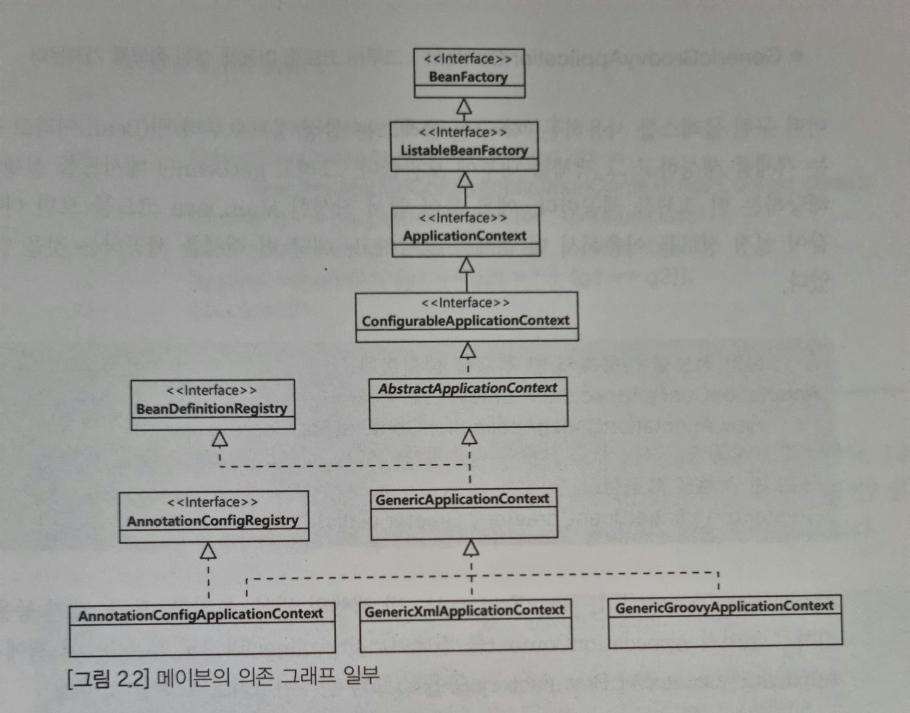

# Spring 5 입문 Chapter 2

## `@Bean`


## `@Bean`과 `@Component`의 차이
*책 내용 아님*


`@Bean` 은 메소드 레벨에서 선언하며, 반환되는 객체(인스턴스)를 개발자가 수동으로 빈으로 등록하는 애노테이션이다. 

반면 `@Component` 는 클래스 레벨에서 선언함으로써 스프링이 런타임시에 컴포넌트스캔을 하여 자동으로 빈을 찾고(detect) 등록하는 애노테이션이다.

 * `@Bean` 예시
``` java
@Configuration
public class AppContext {

    @Bean
    public Greeter greeter() {
        Greeter g = new Greeter();
        g.setFormat("%s, 안녕하세요!");
        return g;
    }

}
```

 * `Component` 예시
``` java
@Component
public class Utility {
   // ...
}
```

| **`@Bean`** | **`@Component`** |
|-------------|------------------|
| 메소드에 사용| 클래스에 사용     |
| 개발자가 컨트롤이 불가능한<br>외부 라이브러리 사용시 사용 | 개발자가 직접 컨트롤이 가능한<br> 내부 클래스에 사용|

<br>

## Spring Container(Ioc 컨테이너, 스프링 컨테이너)

`AppllicationContext`(또는 BeanFactory)는 빈 객체의 생성, 초기화, 보관, 제거 등을 관리하고 있어서 ApplicationContext(또는 `BeanFactory`)를 스프링 컨테이너(Container)라고도 부른다.

<figure>
        
    <figcaption>AnnotaionConfigApplicationContext 계층도 일부</figcaption>
</figure>

```java
//1. 설정 정보를 이용해 빈 객체 생성
AnnotaionConfigApplicationContext ctx = new AnnotaionConfigApplicationContext(AppContext.class);
//2. 빈 객체를 제공
Greeter g = ctx.getBean("greeter", Greeter.class);
```

이름과 실제 객체의 관계뿐만 아니라 실제 객체의 생성, 초기화, 의존 주입 등 스프링 컨테이너는 객체 관리를 위한 다양한 기능을 제공한다.


## 싱글톤(Singleton) 객체

```java
public class Main{

    public static void main(String[] args) {
        AnnotaionConfigApplicationContext ctx = new AnnotaionConfigApplicationContext(AppContext.class);
        Greeter g1 = ctx.getBean("greeter", Greeter.class);
        Greeter g2 = ctx.getBean("greeter", Greeter.class);
        System.out.println("(g1 == g2) 결과 : " + (g1 == g2));
        ctx.close();
    }
}
```
위 코드의 결과로 `(g1 == g2) 결과 : true` 가 출력된다.

(g1 == g2)의 결과가 true라는 것은 같은 객체라는것을 의미한다.

즉 아래 코드에서 getBean() 메서드는 같은 객체를 리턴하는 것이다.
```java
Greeter g1 = ctx.getBean("greeter", Greeter.class);
Greeter g2 = ctx.getBean("greeter", Greeter.class);
```

별도 설정을 하지 않을 경우 스프링은 한개의 빈(Bean) 객체만을 생성한다.

이때 빈 객체는 '싱글톤(singleton)' 범위를 갖는다' 고 표현한다.

스프링은 기본적으로 한 개의 `@Bean` 애노테이션에 대해 한 개의 빈 객체를 생성한다.

<br>

따라서 아래와 같은 설정을 사용한다면 `greeter`와 `greeter1`에 해당하는 2가지 빈(Bean) 객체가 생성된다.
```java
@Bean
public Greeter greeter() {
    Greeter g = new Greeter();
    g.setFormat("%s, 안녕하세요!");
    return g;
}
```

```java
@Bean
public Greeter greeter1() {
    Greeter g = new Greeter();
    g.setFormat("안녕하세요, %s님!");
    return g;
}
```
싱글톤 범위 외에 프로토타입 범위도 존재한다.(Chapter 6에서 살펴봄)