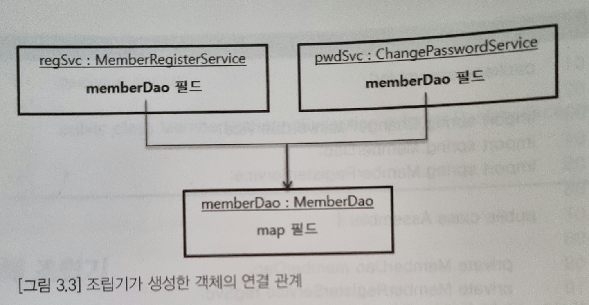

# Spring 5 입문 Chapter 3 스프링 DI

## DI(Dependency Injection, 의존 주입)

DI는 'Dependency Injection'의 약자로 우리말로는 '의존 주입'이라고 번역한다. 이 단어의 의미를 이해하려면 먼저 '의존(Dependency)'이 뭔지 알아야 한다.

<hr>

### 의존(Dependency)

```java
public class MemberRegisterService {
	private MemberDao memberDao = new MemberDao();
	
	public void regist(RegisterRequest req) {
		//이메일로 회원(Member) 데이터 조회
		Member member = memberDao.selectByEmail(req.getEmail());
		if(member != null) {
			// 같은 이메일을 가진 회원이 이미 존재하면 익셉션 발생
			throw new DuplicateMemberException("dup email" + req.getEmail());
		}
		
		// 같은 이메일을 가진 회원이 존재하지 않으면 DB에 삽입
		Member newMember = new Member( 
				req.getEmail(), req.getPassword(), req.getName()
				LocalDateTime.now());
		memberDao.insert(newMember);
	}
}
```
위 코드에서 눈여겨볼 점은 `MemberRegisterService` 클래스가 DB 처리를 위해 `MemberDao` 클래스의 메서드를 사용한다는 점이다.

회원 데이터가 존재하는지 확인하기 위해 `MemberDao` 객체의 `selectByEmail()` 메서드를 실행하고, 회원 데이터를 DB에 삽입하기 위해 `insert()` 메서드를 실행한다.

이렇게 한 클래스가 다른 클래스의 메서드를 실행할 때 이를 '**의존**'한다고 표현한다.

위 코드에서는 "`MemberRegisterService` 클래스가 `MemberDao` 클래스에 의존한다"고 표현할 수 있다.

<br>

의존은 변경에 의해 영향을 받는 관계를 의미한다. 예를 들어 `MemberDao`의 `insert()` 메서드의 이름을 `insertmember()`로 변경하면 이 메서드를 사용하는 `MemberRegisterService` 클래스의 소스 코드도 함께 변경된다. 이렇게 변경에 따른 영향이 전파되는 관계를 '**의존**'한다고 표현한다.

<hr>

의존하는 대상이 있으면 그 대상을 구하는 방법이 필요하다.

가장 쉬운 방법은 의존 대상 객체를 직접 생성하는 것이다.
```java
public class MemberRegisterService {
    //의존 객체를 직접 생성해서 필드에 할당
	private MemberDao memberDao = new MemberDao();
    ...
}
```
`MemberRegisterService` 클래스에서 의존하는 `MemberDao` 객체를 직접 생성하기 때문에 `MemberRegisterService` 객체를 생성하는 순간에 `MemberDao` 객체도 함께 생성된다.

클래스 내부에서 직접 의존 객체를 생성하는 것이 쉽지만 유지보수 관점에서 문제점을 유발할 수 있다. 이 문제점은 뒤에서 다룬다.

의존 객체를 직접 생성하는 방식 외에 의존 객체를 구하는 또 다른 방법은 **DI** 와 **서비스 로케이터**이다. 이 중 스프링과 관련된 것은 **DI**이다.

<br>

의존 객체를 구하는 방법
1. 의존 객체 직접 생성
2. DI(Dependency Injection, 의존 주입)


## DI를 통한 의존 처리

**DI**(Dependency Injection, 의존 주입)는 의존하는 객체를 직접 생성하는 대신 의존 객체를 전달받는 방식을 사용한다.

```java
public class MemberRegisterService {
	private MemberDao memberDao;

    public MemberRegisterService(MemberDao memberDao) {
        this.memberDao = memberDao;
    }
	
	public void regist(RegisterRequest req) {
		...
	}
}
```
앞서 의존(Dependency) 설명 부분에서 사용한 코드를 의존 객체를 직접 생성하는 방식에서 의존 객체를 전달받는 방식으로 바꾸었다.

생성자를 통해서 `MemberRegisterService` **의존(Dependency)**하고 있는 `MemberDao` 객체를 **주입(Injection)** 받은 것이다.

DI를 적용한 결과 `MemberRegisterService` 클래스를 사용하는 코드는 다음과 같이 `MemberRegisterService` 객체를 생성할 때 생성자에 `MemberDao` 객체를 전달해야 한다.

```java
MemberDao dao = new MemberDao();
MemberRegisterService svc = new MemberRegisterService(dao);
```

객체를 생성하는 부분의 코드가 조금 더 길어졌다.
왜 굳이 생성자를 통해서 의존하는 객체를 주입하는 걸까?

이 이유를 알려면 객체 지향 설계에 대한 기본적인 이해가 필요하나 입문 개발자에게는 어려운 개념이 될 수 있다. 그래도 DI를 하는 이유를 조금이라도 이해하려면 알아야할 것이 있다. 바로 **변경의 유연함**이다.


## DI와 의존 객체의 유연함
문제 상황
```
기존 MemberRegisterService와 ChangePasswordService의 소스코드에 MemberDao를 빠른 조회를 위해 캐시를 적용한 CachedMemberDao로 바꾸어라.
CachedmemberDao는 MemberDao 클래스를 상속받았다.
```

**캐시**는 데이터 값을 복사해 놓은 임시 장소.

데이터베이스에서 데이터를 읽어오는데 10밀리초가 걸린다면 메모리에 있는 데이터를 접근할 때는 1밀리초도 안걸릴 것이다. 자주 조회하는 데이터를 메모리를 사용하는 캐시에 보관하면 조회 속도를 향상 시킬 수 있다.

<br>

1. 의존 객체를 직접 생성하는 방법 사용
```java
//변경 전
public class MemberRegisterService {
    private MemberDao memberDao = new memberDao();
}
public class ChangePasswordService {
    private MemberDao memberDao = new memberDao();
}
```
```java
//변경 후
public class MemberRegisterService {
    private MemberDao memberDao = new CachedMemberDao();
}
public class ChangePasswordService {
    private MemberDao memberDao = new CachedMemberDao();
}
```
직접 내부 소스코드를 각 Service마다 변경해야 한다.

2. DI(Dependency Injection, 의존 주입)
```java
//변경 전
MemberDao memberDao = new MemberDao();
MemberRegisterService regSvc = new MemberRegisterService(memberDao);
ChangePasswordService pwdSvc = new ChangePasswordService(memberDao);
```

```java
//변경 후
MemberDao memberDao = new CachedMemberDao();
MemberRegisterService regSvc = new MemberRegisterService(memberDao);
ChangePasswordService pwdSvc = new ChangePasswordService(memberDao);
```
한 곳만 변경하면 된다. 서비스가 많아져도 변경할 곳은 의존 주입 대상이 되는 객체를 생성하는 코드 한 곳 뿐이다.


## 객체 조립기

앞서 DI를 설명할 때 객체 생성에 사용할 클래스를 변경하기 위해 (그 객체를 사용하는 코드를 변경하지 않고) 객체를 주입하는 코드는 한 곳만 변경하면 된다고 했다.

그렇다면 실제 객체를 생성하는 코드는 어디에 있을까? 쉽게 생각하면 다음과 같이 메인 메서드에 객체를 생성하면 될 것 같다.

``` java
public class Main {
    public static void main(String[] args) {
        MemberDao memberDao = new MemberDao();
        MemberRegisterService regSvc = new MemberRegisterService(memberDao);
        ChangePasswordService pwdSvc = new ChangePasswordService(memberDao);
        pwdSvc.setMemberDao(memberDao);
        ...// regSvc와 pwdSvc 를 사용하는 코드
    }
}
```

main 메서드에서 의존 대상 객체를 생성하고 주입하는 방법이 나쁘진 않다.

이 방법보다 좀 더 나은 방법은 객체를 생성하고 의존 객체를 주입해주는 클래스를 따로 작성하는 것이다.

```java
public class Assembler {
    private MemberDao memberDao;
    private MemberRegisterService regSvc;
    private ChangePasswordService pwdSvc;

    public Assembler() {
        MemberDao memberDao = new MemberDao();
        MemberRegisterService regSvc = new MemberRegisterService(memberDao);
        ChangePasswordService pwdSvc = new ChangePasswordService(memberDao);
        pwdSvc.setMemberDao(memberDao);
    }
    
    public MemberDao getMemberDao() {
        return memberDao;
    }

    public MemberRegisterService getMemberRegisterService() {
        return regSvc;
    }

    public ChangePasswordService getChangePasswordService() {
        return pwdSvc;
    }
}
```

의존 객체를 주입한다는 것은 서로 다른 두 객체를 조립한다고 생각할 수 잇는데, 이런 의미에서 이 클래스를 **조립기**라고도 표현한다.

<br>
<p align="center"></p>

`Assembler` 클래스는 아래 코드와 같이 `Assembler` 객체를 만들고 get 메서드를 이용해서 필요한 객체를 구해서 사용하면 된다.
```java
Assembler assembler = new Assembler();
ChangePasswordService changePwdSvc = assembler.getChangePasswordService();
... //changePwdSvc 사용
```

만약 `MemberDao` 클래스가 아니라 `MemberDao` 클래스를 상속받은 `CachedMemberDao` 클래스를 사용해야 한다면 `Assembler` 에서 객체를 초기화하는 코드만 변경하면 된다.

## 스프링의 DI 설정

앞서 의존이 무엇이고 DI를 이용해 의존 객체를 주입하는 방법에 대해 알아보고 조립기에 대해 살펴봤다.

스프링을 설명하는 책에서 스프링 자체가 아닌 의존, DI, 조립기에 대해 먼저 알아본 이유는 스프링이 DI를 지원하는 조립기이기 때문이다.

실제로 스프링은 `Assembler` 클래스의 생성자 코드처럼 필요한 객체를 생성하고 생성한 객체에 의존을 주입한다.

또한 `Assembler` 클래스에 getMemberRegisterService() 메서드처럼 객체를 제공하는 기능을 정의하고 있다. 차이점이라면 스프링은 특정 타입 클래스만 생성하지 않고 범용적인 조립기라는 점이다.

### 스프링을 이용한 객체 조립과 사용

`Assembler` 클래스 대신 스프링을 사용하는 코드를 작성해보자.

```java
@Configuration
public class AppCtx {
    @Bean
    public MemberDao memberDao() {
        return new MemberDao();
    }

    @Bean
    public MemberRegisterService memberRegSvc() {
        return new MemberRegisterService(memberDao());
    }

    @Bean
    public MemberRegisterService changePwdSvc() {
        ChangePasswordService pwdSvc = new ChangePasswordService();
        pwdSvc.setMemberDao(memberDao());
        return new pwdSvc;
    }
}
```

`@Configuration`애노테이션은 스프링 설정 클래스를 의미한다. 이 애노테이션을 붙여야 스프링 설정 클래스로 사용할 수 있다.

`@Bean` 애노테이션은 해당 메서드가 생성한 객체를 스프링 빈이라고 설정한다. 위 코드에서는 세 개의 메서드에 `@Bean` 애노테이션을 붙였는데 각각의 메서드마다 한 개의 빈 객체를 생성한다.

설정 클래스를 만들었다고 끝난 것이 아니다. 객체를 생성하고 의존 객체를 주입하는 것은 스프링 컨테이너이므로 설정 클래스를 이용해서 컨테이너를 생성해야 한다. 

`AnnotaionConfigApplicationContext` 클래스(Chapter 2 참고)를 이용해서 스프링 컨테이너를 생성할 수 있다.

```java
// 위에 있는 AppCtx 클래스를 이용
ApplicationContext ctx = new AnnotaionConfigApplicationContext(AppCtx.class);

// 스프링 컨테이너에서 이름이 "memberRegSvc"인 빈 객체를 구한다.
MemberRegisterService regSvc = ctx.getBean("memberRegSvc", MemberRegisterService.class);

// 스프링 컨테이너에서 이름이 "changePwdSvc"인 빈 객체를 구한다.
ChangePasswordService changePwdSvc = ctx.getBean("changePwdSvc", ChangePasswordService.class);
```

위 과정을 거치면서 몇 가지 에러가 발생할 수 있다.
에러가 발생하면 아래 두 가지 사항을 체크해보자.
1. 빈 설정 메서드이 `@Bean`을 붙이지 않은 경우
2. `@Bean` 설정 메서드의 이름과 `getBean` 메서드에 전달한 이름이 다른 경우

<br>

DI 방식 2가지

1. 생성자 방식
```java
public class MemberRegisterService {
    private MemberDao memberDao;
    //생성자를 통해 의존 객체를 주입 받음
    public MemberRegisterService(MemberDao memberDao) {
        this.memberDao = memberDao;
    }
    ... //memberDao 사용
}

@Configuration
public class AppCtx {
    @Bean
    public MemberRegisterService memberRegSvc() {
        return new MemberRegisterService(memberDao);
    }
    ...
}
```
2. 세터 메서드 방식
```java
public class ChangePasswordService {
    private MemberDao memberDao;
    //세터 메서드를 통해 의존 객체를 주입 받음
    public setMemberDao(MemberDao memberDao) {
        this.memberDao = memberDao;
    }
    ... //memberDao 사용
}

@Configuration
public class AppCtx {
    @Bean
    public MemberRegisterService changePwdSvc() {
        ChangePasswordService pwdSvc = new ChangePasswordService();
        pwdSvc.setMemberDao(memberDao());
        return new pwdSvc;
    }
    ...
}
```

<br>

* DI 방식 각각의 장점

생성자 방식은 빈 객체를 생성하는 시점에 모든 의존 객체가 주입된다.<br>
세터 메서드 방식은 세터 메서드 이름을 통해 어떤 의존 객체가 주입되는지 알 수 있다.

각각의 장점이 곧 다른 방식의 단점이다. 생성자 방식은 생성자 파라미터가 많을 경우 각 인자가 어떤 의존 객체를 설정하는지 알아내려면 생성자 코드를 확인해야 한다.

반면 세터 메서드 방식은 의존 객체를 전달하지 않아도 빈 객체가 생성되기 때문에 객체를 사용하는 시점에 NullPointerExceptiopn이 발생할 수 있다.


## @Configuration 설정 클래스의 @Bean 설정과 싱글톤

```java
@Configuration
public class AppCtx {
    @Bean
    public MemberDao memberDao() {
        return new MemberDao();
    }

    @Bean
    public MemberRegisterService memberRegSvc() {
        return new MemberRegisterService(memberDao);
    }

    @Bean
    public ChangePasswordService changePwdSvc() {
        ChangePasswordService pwdSvc = new ChangePasswordService();
        pwdSvc.setMemberDao(memberDao());
        return new pwdSvc;
    }
}
```

`memberRegSvc()`와 `changePwdSvc()` 둘 다 `memberDao()` 메서드를 실행하고 있다.<br>
"`memberRegSvc()`와 `changePwdSvc()` 에서 각각 `memberDao()` 메서드로 `new MemberDao()`를 실행하니 각각 사용하는 `MemberDao`는 서로 다른 것이 아닌가?"라는 궁금증이 생길 수 있다.

앞서 chapter2에서 스프링 컨테이너가 생성한 빈은 싱글톤 객체라고 했다.<br>
**스프링 컨테이너는 `@Bean`이 붙은 메서드에 대해 한 개의 객체만 생성한다.**<br>
이는 다른 설정 메서드에서 `memberDao()`를 몇 번을 호출하더라도 항상 같은 객체를 리턴한다는 것을 의미한다.

스프링은 설정 클래스를 그대로 사용하지 않는다. 대신 설정 클래스를 상속한 새로운 설정 클래스를 만들어서 사용한다.<br>

스프링 런타임에 생성한 설정 클래스는 다음과 유사한 방식으로 동작한다.(이해를 위해 단순화 시킨 코드. 실제 코드는 훨씬 복잡함)
```java
public class AppCtxExt extends AppCtx {
    private Map<String, Object> beans = ...;

    @Override
    public memberDao memberDao() {
        if(beans.containsKey("memberDao"))
            beans.put("memberDao", super.memberDao());

        return (MemberDao) beans.get("memberDao");
    }
    ...
}
```
한 번 생성한 객체를 보관했다가 이후에는 동일한 객체를 리턴한다.

따라서 `memberRegSvc()` 메서드와 `changePwdSvc()` 메서드에서 `memberDao()` 메서드를 각각 실행해도 동일한 `MemberDao` 객체를 사용한다.

## 두 개 이상의 설정 파일 사용하기

* `AppConf1.class` 소스코드
```java
@Configuration
public class AppConf1 {
    @Bean
    public MemberDao memberDao() {
        return new MemberDao();
    }

    @Bean
    public MemberPrinter memberPrinter() {
        return new MemberPrinter();
    }
}
```

* `AppConf2.class` 소스코드
```java
@Configuration
public class AppConf2 {
    @Autowired
    private MemberDao memberDao;
    @Autowired
    private MemberPrinter memberPrinter;

    @Bean
    public MemberRegisterService MemberRegisterService() {
        return new MemberRegisterService(memberDao);
    }

    @Bean
    public ChangePasswordService changePwdSvc() {
        ChangePasswordService pwdSvc = new ChangePasswordService();
        pwdSvc.setMemberDao(memberDao());
        return pwdSvc;
    }
    ... //memberDao와 memberPrinter 사용 @Bean 코드들
}
```

설정 클래스가 두 개 이상이여도 다음과 같이 파라미터로 설정 클래스를 추가로 전달하면 된다.
```java
ctx = new AnnotaionConfigApplicationContext(AppConf1.class, AppConf2.class);
```

`@Autowired` 애노테이션은 **Chapter 4**에서 자세히 다루나 나왔으니 설명한다.<br>

여기서 `@Autowired` 애노테이션은 스프링 자동 주입 기능을 위한 것이다.<br>
스프링 설정 클래스 필드에서 `@Autowired` 애노테이션을 붙이면 해당 타입의 빈을 찾아서 필드에 할당한다. 

만약 `ChangePasswordService` 클래스에 의존 객체 `memberDao`에 `@Autowired` 애노테이션을 붙인다면 자동 주입되므로 세터 메서드를 생략해도 된다.
```java
public class ChangePasswordService {
    @Autowired
    private MemberDao memberDao;

    ... //memberDao 사용코드

    //세터 생략
}
```

```java
@Configuration
public class AppConf2 {
    @Autowired
    private MemberDao memberDao;

    ...

    @Bean
    public ChangePasswordService changePwdSvc() {
        ChangePasswordService pwdSvc = new ChangePasswordService();
        /*
        스프링 컨테이너가 @Autowired를 붙인 필드에 
        자동으로 해당 타입의 빈 객체를 주입하기 때문에 
        세터 메서드를 사용해서 주입을 하지 않아도 된다.
        */
        // pwdSvc.setMemberDao(memberDao());
        return pwdSvc;
    }
    
    ...
}
```
스프링 컨테이너는 `AppConf2` 객체를 빈으로 등록하고, `@Autowired`에 대해서도 자동 주입을 처리한다. 실제로 `@Configuration` 애노테이션이 붙은 설정 클래스를 내부적으로 스프링 빈으로 등록한다.
```java
AbstractAppllicationContext ctx = new AnnotaionConfigApplicationContext(AppConf1.class, AppConf2.class);
// @Configuration 설정 클래스도 빈으로 등록함
AppConf1 appConf1 = ctx.getBean(AppConf1.class);
System.out.println(appConf1 != null) // true가 출력된다.
```

### @Import 애노테이션 사용

두 개 이상의 설정 파일을 사용하는 또 다른 방법은 `@Import` 애노테이션을 사용하는 것이다.

`@Import` 애노테이션은 함께 사용할 설정 클래스를 지정한다.

* `AppConfImport.class` 소스코드
```java
@Configuration
@Import(AppConf2.class)
public class AppConfImport {
    @Bean
    public MemberDao memberDao() {
        return new MemberDao();
    }

    @Bean
    public MemberPrinter memberPrinter() {
        return new MemberPrinter();
    }
}
```

`AppConfImport` 설정 클래스를 사용하면, `@Import` 애노테이션으로 지정한 AppConf2 설정 클래스도 함께 사용하기 때문에 스프링 컨테이너를 생성할 때 `AppConf2` 설정 클래스를 지정할 필요가 없다.

`AppConfImport` 클래스만 사용하면  `AppConf2` 클래스의 설정도 함께 사용해서 컨테이너를 초기화 한다.

아래 코드와 같이 배열을 이용해서 두 개 이상의 설정 클래스도 지정할 수 있다.
```java
@Configuration
@Import( { AppConf1, AppConf2 } )
public class AppConfImport {

}
```

## getBean() 메서드 사용

```java
ctx.getBean("빈의 이름", 클래스명.class);
``` 

에러가 자주 나는 경우 3가지

1. 이름이 다름
```java
ctx.getBean("AAA", abc.class); // 빈의 이름이 abc 인데 AAA를 인자로 줌
```
<br>

2. 빈의 실제 타입과 지정한 타입이 다름
```java
ctx.getBean("abc", AAA.class); // 빈의 실제 타입이 abc.class 인데 AAA.class 를 인자로 줌
```

<br>

3. 해당 타입 빈이 한 개가 아님

다음과 같이 이름을 지정하지 않고 타입으로만 빈을 구할 수도 있다.
```java
AAA aaa = ctx.getBean(AAA.class);
```
하지만 아래와 같이 AAA의 빈이 두 개가 있다면 오류가 발생한다.
```java 
@Configuration
public class AppCtx {
    @Bean
    public AAA newAAA() {
        return new AAA();
    }

    @Bean
    public AAA oldAAA() {
        return new AAA();
    }
}
```


## 주입 대상 객체를 모두 빈 객체로 설정해야 하나?

꼭 그럴필요는 없다.<br>
일반 객체로 생성해서 주입할 수 있다.

```java
public class AppCtxNoMemberBean {
    private MemberDao memberDao = new MemberDao(); // 빈이 아님

    ...
}
```

`AppCtxNoMemberBean` 클래스는 정상 작동한다.

객체를 스프링 빈으로 등록할 때와 등록하지 않을 때의 차이는 스프링 컨테이너가 객체를 관리하는지 여부이다.

```java
//AppCtxNoMemberBean에서 빈으로 등록하지 않았으므로 익셉션이 발생한다.
MemberDao memberDao = ctx.getBean(MemberDao.class);
```

스프링 컨테이너가 제공하는 관리 기능이 필요없고 getBean() 메서드로 구할 필요가 없다면 빈 객체로 꼭 등록해야 하는 것은 아니다.

최근에는 의존 자동 주입 기능을 프로젝트 전반에 걸쳐 사용하는 추세이기 때문에 의존 주입 대상은 스프링 빈으로 등록하는 것이 보통이다.
