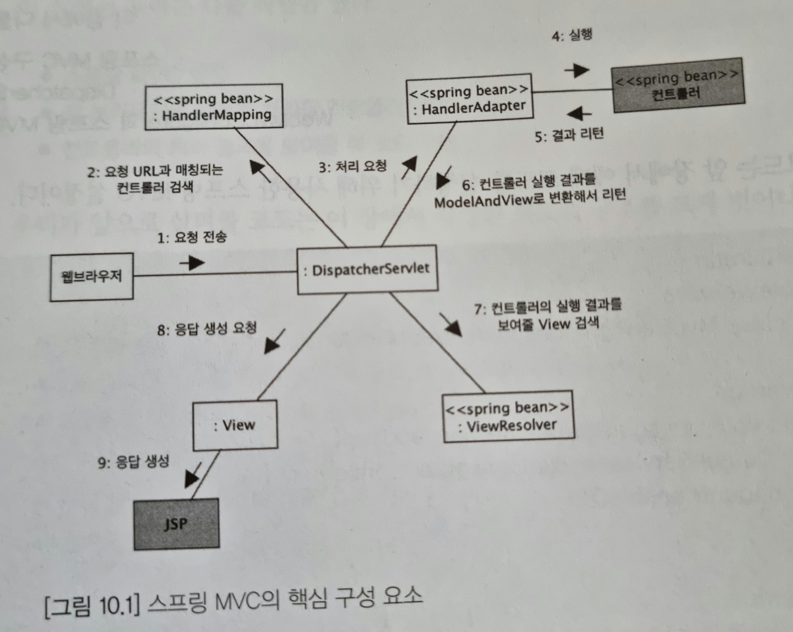

# Spring 5 입문 Chapter10_스프링 MVC 프레임워크 동작 방식


## 스프링 MVC 핵심 구성 요소

아래 그림은 스프링 MVC의 핵심 구성 요소와 각 요소 간의 관계를 정리한 것이다.(매우 중요)

회색 배경을 가진 구성 요소는 개발자가 직접 구현해야 하는 요소이다. (예를 들어 9장에서 구현한 `hello`가 컨트롤러에 해당한다.)

<p align="center"></p>

`DispatcherServlet`은 모든 연결을 담당한다. 아래 번호 목록은 위 그림에 `DispatcherServlet`의 동작 과정을 글로 정리한 것이다.
1. 웹 브라우저로부터 요청이 들어옴
2. `DispatcherServlet`은 그 요청을 처리하기 위한 컨트롤러 객체를 검색<br>
`DispatcherServlet`이 직접 검색하지 않고 `HandlerMapping`이라는 빈 객체에게 컨트롤러 검색 요청
3. `HandlerMapping`은 클라이언트의 요청 경로를 이용해 이를 처리할 컨트롤러 빈 객체를 `DispatcherServlet`에 전달<br>
예를 들어 웹 요청'/hello'라면 등록된 컨트롤러 빈 중에 '/hello'요청 경로를 처리할 컨트롤러를 리턴함
4. `DispatcherServlet`은 `HandlerMapping`이 찾아준 컨트롤러 객체를 처리할 수 있는 HandlerAdapter 빈에게 요청 처리를 위임한다.(그림 3번 과정)<br>
컨트롤러 객체를 `DispatcherServlet`이 전달받았다고 해서 바로 컨트롤러 객체의 메서드를 실행할 수 있는 것은 아니다. `@Controller`, `Controller` 인터페이스, `HttpRequestHandler` 인터페이스를 동일한 방식으로 처리하기 위해 중간에 사용되는 것이 바로 `HandlerAdapter` 빈이다.
5. `HandlerAdapter`는 컨트롤러의 알맞은 메서드를 호출해서 요청 처리(그림 4~5번 과정)
6. 처리 결과를 `ModelAndView`라는 객체로 변환해서 `DispatcherServlet`에 리턴
7. `HandlerAdapter`로부터 컨트롤러의 요청 처리 결과를 `ModelAndView`로 받으면 `DispatcherServlet`은 결과를 보여줄 뷰를 찾기 위해 `ViewResolver` 빈 객체를 사용(그림 7번 과정)
8. `ModelAndView`는 컨트롤러가 리턴한 뷰 이름을 담고 있는데 `ViewResolver`는 이 뷰 이름에 해당하는 View 객체를 찾거나 생성해서 리턴
9. `DispatcherServlet`은 `ViewResolver`가 리턴한 View 객체에 응답 결과 생성을 요청(그림 8번 과정)
10. JSP를 사용하는 경우 View 객체는 JSP 를 실행함으로써 웹 브라우저에 전송할 응답 결과를 생성하고 이로써 모든 과정이 끝난다.


<br><br>

### 컨트롤러와 핸들러

클라이언트의 요청을 실제로 처리하는 것은 컨트롤러이고 `DispatcherServlet`은 클라이언트의 요청을 전달받는 창구 역할을 한다.

`DispatcherServlet`은 클라이언트의 요청을 처리할 컨트롤러를 찾기 위해 `HandlerMapping`을 사용한다. 컨트롤러를 찾아주는 객체는 `ControllerMapping` 타입이여야 할 것 같은데 실제는 `HandlerMapping`이다. 왜 `HandlerMapping`일까?

스프링 MVC는 웹 요청을 처리할 수 있는 범용 프레임워크이다. `DispatcherServlet` 입장에서는 클라이언트 요청을 처리하는 객체의 타입이 반드시 `@Controller`를 적용한 클래스일 필요는 없다.(자신이 직접 만튼 클래스를 이용해 클라이언트의 요청 처리 가능) 실제로 클라이언트의 요청을 처리하기 위해 제공하는 타입 중에는 `HttpRequestHandler`도 존재한다.

이런 이유로 스프링 MVC는 웹 요청을 실제로 처리하는 객체를 핸들러(Handler)라고 표현하고 있으며 `@Controller` 적용 객체나 `Controller` 인터페이스를 구현하는 객체는 모두 스프링 MVC 입장에서는 핸들러가 된다.

`DispatcherServlet`은 핸들러 객체의 실제 타입에 상관없이 실행 결과를 `ModelAndView` 타입으로만 받을 수 있으면 된다. 그런데 핸들러의 실제 구현 타입에 따라 `ModelAndView`를 리턴하는 객체도 있고, 그렇지 않은 객체도 있다.(9장에서 구현한 `Chap9Controller`) 따라서 핸들러의 처리 결과를 `ModelAndView`로 변환해주는 객체가 필요하며 이 변환을 `HandlerAdapter`가 처리해준다.

<br>

DispatcherServlet과 스프링 컨테이너 내용은 Spring 내용같아서 스킵.

<br>
<br>

## @Controller를 위한 HandlerMapping과 HandlerAdapter

`DispatcherServlet`은 스프링 컨테이너에서 `HandlerMapping`와 `HandlerAdapter`타입의 빈을 사용하므로 핸들러에 알맞은 `HandlerMapping` 빈과 `HandlerAdapter` 빈이 스프링 설정에 등록되어 있어야 한다.

하지만 9장에서 작성한 예제를 보면 `@EnableWebMvc` 애노테이션만 추가했다.(책에서는 추가 했으나 스프링 내용 같아서 따로 정리하진 않음. 대신 9장-`@SpringBootApplication` 애노테이션 설명부분에서 언급함) 이 애노테이션은 매우 다양한 스프링 빈 설정을 추가해 준다. 

이 설정을 사용하지 않고 설정 코드를 직접 작성하려면 백 여 줄에 가까운 코드를 입력해야 한다.

이 태그가 빈으로 추가해주는 클래스 중에는 `@Controller` 타입의 핸들러 객체를 처리하기 위한 `RequestMappingHandlerMapping`과 `RequestMappingHandlerApdater` 클래스가 포함되어 있다.

`RequestMappingHandlerMapping`은 `@Controller` 애노테이션이 적용된 객체의 요청 매핑 애노테이션(`@GetMapping`) 값을 이용해서 웹 브라우저의 요청을 처리할 컨트롤러 빈을 찾는다.

`RequestMappingHandlerApdater`는 컨트롤러의 메서드를 알맞게 실행하고 그 결과를 `ModelAndView` 객체로 변환해서 `DispatcherServlet`에 리턴한다. 9장의 `Chap9Controller`를 다시 보자

```java
@Controller
public class Chap9Controller {

	@RequestMapping("/hello")
	public String hello(Model model,
			@RequestParam(value="name", required = false)String name) {
		model.addAttribute("Jang", name);
		return "index";
	}
}
```

`RequestMappingHandlerApdater`는 컨트롤러 메서드의 결과 값이 String 타입이면 해당 값을 뷰 이름으로 갖는 `ModelAndView` 객체를 생성해서 `DispatcherServlet`에 리턴한다. 이때 첫 번째 파라미터로 전달한 `Model` 객체에 보관된 값도 `ModelAndView`에 함께 전달한다. 예제 코드는 "index"를 리턴하므로 뷰 이름으로 "index"를 사용한다.

<br>
<br>

## ViewResolver

```java
@Configuration
@EnableWebMvc
public class Chapter10Conf implements WebMvcConfigurer {
	@Bean
	public ViewResolver viewResolver() {
		InternalResourceViewResolver vr = new InternalResourceViewResolver();
		vr.setPrefix("/WEB-INF/view/");
		vr.setSuffix(".jsp");
		return vr;
	}
}
```

컨트롤러의 실행 결과를 받은 `DispatcherServlet`은 `ViewResolver`에게 뷰 이름에 해당하는 `View` 객체를 요청한다. 이때 `InternalResourceViewResolver`는 "prefix+뷰이름+suffix"에 해당하는 경로를 뷰 코드로 사용하는 `InternalResourceView` 타입의 `View`객체를 리턴한다. 예를 들어 뷰 이름이 "hello"라면 "/WEB-INF/view/hello.jsp" 경로를 뷰 코드로 사용하는 `InternalResourceView` 객체를 리턴한다.


스프링부트에서 설정은 다음과 같다.

```properties
## application.properties
spring.mvc.view.prefix=/WEB-INF/view/
spring.mvc.view.suffix=.jsp
```


<br>

`DispatcherServlet`은 컨트롤러의 실행 결과를 `HandlerAdapter`를 통해서 `ModelAndView` 형태로 받는다고 했다. `Model`에 담긴 값은 View 객체에 `Map` 형식으로 전달된다.

예를 들어 아래 코드와 같은 경우 `DispatcherServlet`은 `View` 객체에 응답 생성을 요청할 때 Jang 키를 갖는 `Map` 객체를 `View` 객체에 전달한다.

```java
@Controller
public class Chap9Controller {

	@RequestMapping("/hello")
	public String hello(Model model,
			@RequestParam(value="name", required = false)String name) {
		model.addAttribute("Jang", name);
		return "index";
	}
}
```

`InternalResourceView`는 `Map` 객체에 담겨 있는 키 값을 `request.setAttribute()`를 이용해서 request의 속성에 저장한다. 그런 뒤 해당 경로에 JSP를 실행한다.

<br>
<br>
<br>


## 정리

`DispatcherServlet`은 웹 브라우저의 요청을 받기 위한 역할을 하고, 다른 주요 구성 요소들을 이용해서 요청 흐름을 제어하는 역할을 한다.

`HandlerMapping`은 클라이언트의 요청을 처리할 핸들러 객체를 찾아준다. 핸들러 객체는 클라이언트의 요청을 실제로 처리한 뒤 뷰 정보와 모델을 설정한다.

`HandlerAdapter`는 `DispatcherServlet`과 핸들러 객체 사이의 변환을 알맞게 처리해 준다.

`ViewResolver`는 요청 처리 결과를 생성할 `View`를 찾아주고 `View`는 최종적으로 클라이언트에 응답을 생성해서 전달한다.

실제 동작 방식은 훨씬 더 복잡하지만 지금 일련의 처리 과정을 머리속에 그릴 수 있으면 스프링 MVC를 이용한 웹 개발을 어렵지 않게 해 나갈 수 있다.

<br>
<br>

## 책 이외 내용

### 스프링 톰캣부터 서비스까지의 흐름

1. 톰캣 시작
2. 필터들이 메모리에 올라옴(권한 필터, 인증 필터, 인코딩 필터 등등)
3. Dispatcher가 메모리에 올라옴
4. Controller - Service - JPA Repository - 영속성 컨텍스트가 메모리에 올라옴
이 부분은 사용자가 요청할 때마다 쓰레드를 생성해서 사용한다. 즉 또 다른 사용자가 요청을 하면 쓰레드가 하나씩 만들어지고 Controller - Service - JPA Repository - 영속성 컨텍스트 객체를 사용하는 것이다. Controller - Service - JPA Repository는 빈 객체이기 때문에 싱글톤으로 단 한번만 메모리에 올라가고 영속성 컨텍스트는 요청마다 생성된다.

그래서 기본적으로 1~3 과정은 톰캣이 시작되면서 메모리에 올라오지만 4과정은 Request(요청)이 올 때까지 대기하게 된다.

DataSource는 톰캣이 시작되면서 미리 메모리에 올라와 있는다. DataSource는 DB와 직접적인 연결이 되어있다.

ViewResolver와 인터셉터도 메모리에 올라와 있는다.

만약 '/user/1'이라는 url이 1번 유저의 개인정보를 보는 url이라면 권한 체크를 해야한다. `/user`를 받는 컨트롤러가 실행되기 전후 과정에 사용되는 것이 인터셉터이다.([13장](./chapter13_MVC3.md) 내용)

출처: [스프링부트 강좌 59강(블로그 프로젝트) - 스프링작동원리 복습](https://www.youtube.com/watch?v=S7LBQxgoVP0)