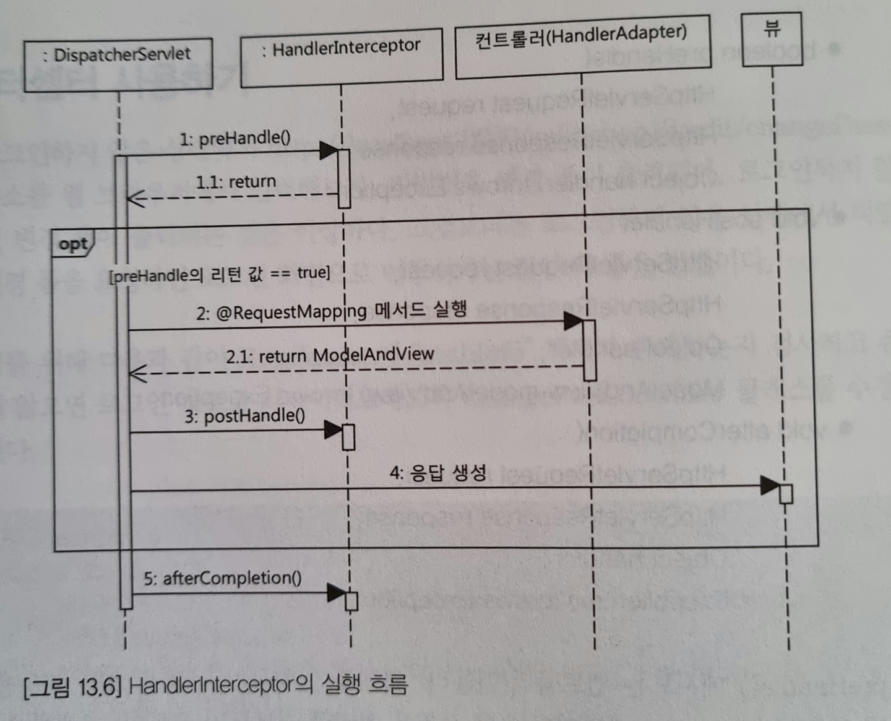
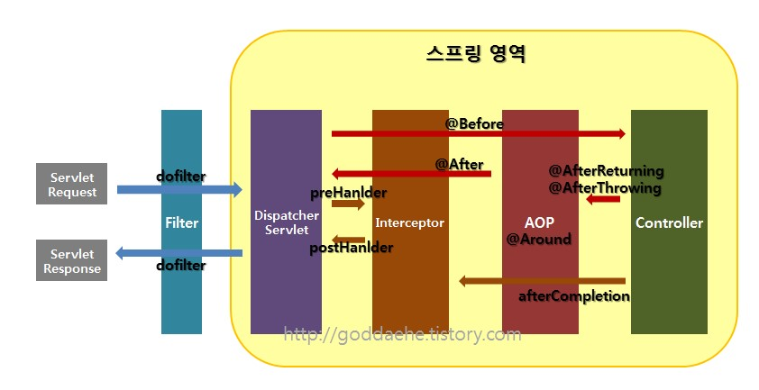

# Spring 5 입문 Chapter13 MVC3: 세션, 인터셉터, 쿠키

## 컨트롤러에서 HttpSession 사용하기

만약 당신이 로그인 기능을 구현한다면 로그인 상태를 유지하는 방법을 알아야 한다.

로그인 상태를 유지하는 방법은 크게 `HttpSession`을 이용하는 방법과 쿠키를 이용하는 방법이 있다. 외부 데이터베이스에 세션 데이터를 보관하는 방법도 사용하는데 큰 틀에서 보면 `HttpSession`과 쿠키의 두 가지 방법으로 나뉜다.

<br>

컨트롤러에서 `HttpSession`을 사용하려면 다음의 두 가지 방법 중 한 가지를 사용하면 된다.

1. 요청 매핑 애노테이션 적용 메서드에 `HttpSession` 파라미터 추가
2. 요청 매핑 애노테이션 적용 메서드에 `HttpServletRequest` 파라미터를 추가하고 Request를 이용해 `HttpSession` 구하기

```java
//1번 방법
@RequestMapping("/sessionCheck1")
public String sessionEx2(/*...*/ HttpSession session) {
	return "index";
}
```
요청 매핑 애노테이션 적용 메서드에 `HttpSession` 파라미터가 존재할 경우 스프링 MVC는 컨트롤러의 메서드를 호출할 때 `HttpSession` 객체를 파라미터로 전달한다.

`HttpSession`을 생성하기 전이면 새로운 `HttpSession`을 생성하고 그렇지 않으면 기존에 존재하는 `HttpSession`을 전달한다.

<br>

```java
//2번 방법
@RequestMapping("/sessionCheck2")
public String sessionEx1(/*...*/ HttpServletRequest request) {
	HttpSession session = request.getSession();
	return "index";
}
```
첫 번째 방법은 항상 `HttpSession`을 생성하지만 두 번째 방법은 필요한 시점에만 `HttpSession`을 생성할 수 있다.

<br>

```java
public class AuthInfo {
	private long id;
	private String email;
	private String name;
	
	...
}
```
만약 위와 같은 객체를 사용해서 로그인 상태를 유지한다면 아래와 같은 코드를 작성할 수 있다.
```java
//여기선 2번 방법을 사용했다.
@RequestMapping("/sessionCheck2")
public String sessionEx1(/*...*/ AuthInfo authInfo, HttpServletRequest request) {
	... //커맨드 객체 검증 및 각종 처리
    HttpSession session = request.getSession();
    session.setAttribute("authInfo", authInfo);
    //AuthInfo authInfo = (AuthInfo) session.getAttribute("authInfo")
	return "index";
}
```
사용자를 확인하고 싶다면 주석처리된 `AuthInfo authInfo = (AuthInfo) session.getAttribute("authInfo")` 코드처럼 작성하고 authInfo 객체에 값을 확인하면 된다.

<br>
<br>

## 인터셉터 사용하기

만약 당신이 로그인하지 않았는데 비밀번호 변경화면으로 이동을 시도한다면 어떻게 처리해야 할까? 로그인하지 않았는데 변경 폼이 출력되는 것은 이상하다. 그것보다는 로그인하지 않은 상태에서 비밀번호 변경 폼을 요청하면 로그인 화면으로 이동시키는 것이 더 좋은 방법이다. 

```java
@GetMapping("/pwdChange")
public String pwdChange(/*...*/ HttpSession session) {
    AuthInfo authInfo = (AuthInfo) session.getAttribute("authInfo");
    if(authInfo == null) return "redirect:/login"; // 로그인 여부 확인.
    ...
}
```

하지만 우리가 가정한 환경이 아닌 실제 웹 어플리케이션에서는 비밀변경 변경 기능 외에도 더 많은 기능에 로그인 여부를 확인해야 할 것이다. 각 기능에 구현한 컨트롤러 코드마다 세션 확인 코드를 삽입하는 것은 많은 중복을 일으킨다.

이렇게 다수의 컨트롤러에 대해 동일한 기능을 적용해야 할 때 사용할 수 있는 것이 `HandlerInterceptor`이다.

<br>

### HandlerInterceptor 인터페이스 구현하기

`HandlerInterceptor` 인터페이스를 사용하면 다음의 세 시점에 공통 기능을 넣을 수 있다.

1. 컨트롤러(핸들러) 실행 전
2. 컨트롤러(핸들러) 실행 후, 아직 뷰를 실행하기 전
3. 뷰를 실행한 이후

세 시점을 처리하기 위해 `HandlerInterceptor` 인터페이스는 다음 메서드를 정의하고 있다.

1. `boolean preHandle(HttpServletRequest request, HttpServletResponse response, Object handler) throws Exception`
2. `void postHandle(HttpServletRequest request, HttpServletResponse response, Object handler, ModelAndView modelAndView) throws Exception`
3. `void afterCompletion(HttpServletRequest request, HttpServletResponse response, Object handler, Exception ex) throws Exception`

<br>

`preHandle()` 메서드는 **컨트롤러(핸들러) 객체를 실행하기 전**에 필요한 기능을 구현할 때 사용한다. `handler` 파라미터는 웹 요청을 처리할 컨트롤러(핸들러) 객체이다. 이 메서드를 사용하면 다음 작업이 가능하다.

* 로그인하지 않은 경우 컨트롤러를 실행하지 않음
* 컨트롤러 실행하기 전에 컨트롤러에서 필요로 하는 정보 생성

`preHandle()` 메서드의 리턴 타입은 `boolean`이다. `preHandle()` 메서드가 false를 리턴하면 컨트롤러(또는 다음 `HandlerInterceptor`)를 실행하지 않는다.

<br>

`postHandle()` 메서드는 컨트롤러(핸들러)가 **정상적으로 실행된 이후** 추가 기능을 구현할 때 사용한다. 컨트롤러가 익셉션을 발생하면 `postHandle()` 메서드는 실행하지 않는다.

<br>

`afterCompletion()` 메서드는 **뷰가 클라이언트에 응답을 전송한 뒤**에 실행된다. 컨트롤러 실행 과정에서 익셉션이 발생하면 이 메서드의 네 번째 파라미터로 전달된다. 익셉션이 발생하지 않으면 네 번째 파라미터는 null이 된다. 따라서 컨트롤러 실행 이후 예기치 않게 발생한 익셉션을 로그로 남긴다거나 실행 시간을 기록하는 등의 후쳐리를 하기에 적합한 메서드다.

<br>

* `HandlerInterceptor`의 흐름
<p align="center"></p>

<br>

`HandlerInterceptor` 인터페이스의 메서드를 모두 구현할 필요 없고 이 인터페이스를 상속받고 필요한 메서드만 재정의 하면 된다.

<br>
<br>

다시 상황으로 돌아와서 로그인 정보가 있으면 컨트롤러를 실행하도록 인터셉터를 구현하면 다음과 같다.
```java
public class AuthCheckInterceptor implements HandlerInterceptor{

	@Override
	public boolean preHandle(HttpServletRequest request, HttpServletResponse response, Object handler)
			throws Exception {
		HttpSession session = request.getSession();
		if(session != null) {
			Object authInfo = session.getAttribute("authInfo");
			if(authInfo != null) {
				return true;
			}
		}
		response.sendRedirect(request.getContextPath() + "/login");
		return false;
	}
	
}
```

<br>
<br>

### HandlerInterceptor 설정하기

`HandlerInterceptor`를 구현하면 `HandlerInterceptor`를 어디에 적용할지 설정해야 한다. 관련 설정은 다음과 같다.
```java
@Configuration
@EnableWebMvc
public class MvcConfig implements WebMvcConfigurer{
	@Bean
	public AuthCheckInterceptor authCheckInterceptor() {
		return new AuthCheckInterceptor();
	}
	
	@Override
	public void addInterceptors(InterceptorRegistry registry) {
		registry.addInterceptor(authCheckInterceptor())
			.addPathPatterns("/chapter13/**"); 
        // Ant 경로 패턴을 사용해 /chapter13/으로 시작하는 모든 경로에 인터셉터 적용
        // 제외패턴은 .excludePathPatterns("~~")를 사용
	}
}
```

Ant 패턴은 *, **, ?의 세 가지 특수 문자를 이용해서 경로를 표현한다. 각 문자는 다음의 의미를 갖는다.

* *: 0개 또는 그 이상의 글자
* ?: 1개 글자
* **: 0개 또는 그 이상의 폴더 경로

<br>

경로 표현 예는 다음과 같다
* /member/?*.info -> /member/로 시작하고 .info로 끝나느 모든 경로
* /faq/f?OO.fq -> /faq/f로 시작하고 OO.fq로 끝나느 모든 경로
* /folders/**/files -> /folders/로 시작하고 중간애 0개 이상의 중간 경로가 존재하고 /files로 끝나는 모든 경로. 예를 들어 /folders/files, /folders/1/2/3/files 등이 일치


<br>
<br>

## 컨트롤러에서 쿠키 사용

사용자 편의를 위해 아이디를 기억해 두었다가 다음에 로그인할 때 아이디를 자동으로 넣어주는 사이트가 많다. 이 기능을 구현할 때 쿠키를 사용한다.

스프링 MVC에서 쿠키를 사용하는 방법 중 하나는 `@CookieValue` 애노테이션을 사용하는 것이다. `@CookieValue` 애노테이션은 요청 매핑 애노테이션 적용 매서드의 `Cookie` 타입 파라미터에 적용한다. 이를 통해 쉽게 쿠키를 `Cookie` 파라미터로 전달받을 수 있다.

```java
@RequestMapping("/cookieCheck")
public String cookieEx(@CookieValue(value="REMEMBER", required = false)Cookie rCookie) {
	if(rCookie != null) {
		...
	}
	return "index";
}
```

위 예제는 `REMEMBER`인 쿠키를 `Cookie`타입으로 전달 받고 필수로 전달받지 않는다.

로그인할 때 아이디를 자동으로 넣어주는 기능을 만들 때는 이메일 주소를 저장할 때 평문을 그대로 저장하면 안된다. 이메일 주소는 민감한 개인 정보이므로 실제 서비스에서는 암호화해서 보안을 높혀야 한다.

<br>
<br>
<br>

## HandlerInterceptor 이외 공통 처리를 위해 활용 가능한 것(책 내용 아님)

Spring Framework에서 지원하는 기능이며, URI 요청, 응답 시점을 가로채서 전/후 처리를 하는 역할을 합니다. Interceptor 시점에 Spring Context와 Bean에 접근할 수 있습니다. 

이와 비슷한 역할로 `Filter`와 `AOP`가 있습니다.

Filter는 Spring Framework와 무관하게 동작하며, Spring 자원을 이용할 수 없습니다. Filter는 보통 인코딩, XSS방어 등...의 용도로 이용됩니다. 

AOP는 주로 비즈니스 로직에서 실행됩니다. Logging, transaction 처리 등 중복 코드가 발생할 경우 중복을 줄이기 위해 사용되며, 메소드 처리 전후 지점에 자유롭게 설정이 가능합니다.  

* Filter, Interceptor, AOP 흐름
<p align="center"></p>

[출처]https://goddaehee.tistory.com/154

<br>
<br>
