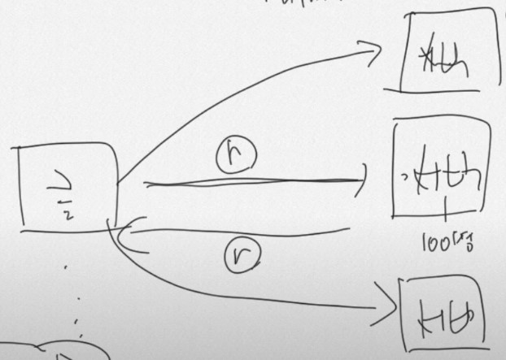
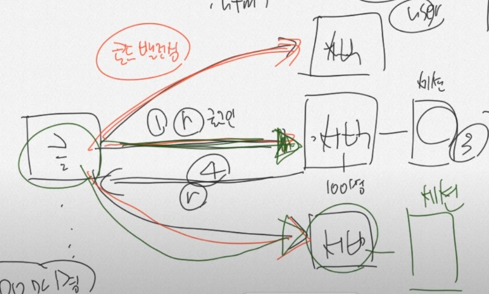
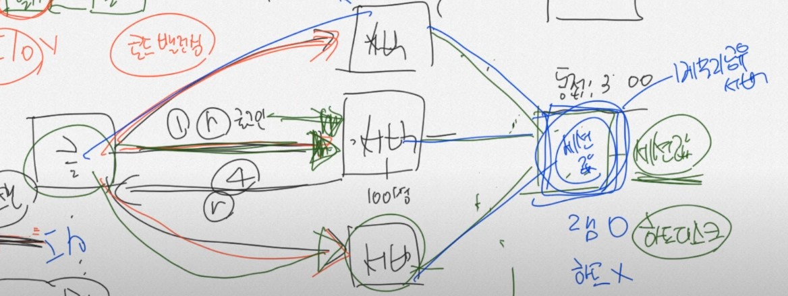

# 13~18강

JWT 사전 지식 설명 정리

<br>

해당 md파일에 사진 출처 <br>
 https://www.youtube.com/watch?v=cv6syIv-8eo&list=PL93mKxaRDidERCyMaobSLkvSPzYtIk0Ah&index=13

## 세션 - 12

사용자가 웹 브라우저를 킨다.

`www.naver.com`을 주소창에 적는다.

서버에서 해당주소에 해당하는 컨트롤러를 찾고 .html파일 리턴

이때 http 헤더를 달아준다.

헤더에 쿠키를 만들어서 세션아이디를 넣는다.

최초에 세션아이디를 넣어주는것이다. 재요청시에는 헤더에 세션ID가 이미 존재하기 때문에 세션ID를 그대로 돌려준다.

세션아이디가 사라지는 경우는 서버에서 세션값을 날린 경우, 사용자가 브라우저를 종료한 경우, 설정한 시간이 흐른 경우가 있다. 

<br>
<br>

### 로드 밸런싱 - 12

<p align="center"></p>

만약 서버가 100명의 동시 접속자를 수용할 수 있는데 300명이 접속한다면 100명이 접속하고 나머지 200명은 기다려야 한다. 이 상황을 해결하기 위해 다음과 같이 100명을 수용할 수 있는 서버를 3개를 두는 것이다.

<p align="center"></p>

하나의 서버에 몰리면 다른 서버로 가고... 이렇게 만들면 부하가 안걸릴 것이다. 이렇게 만드는 것을 '**로드 밸런싱**'이라 부른다.

<br>

근데 서버의 로그인을 세션으로 관리한다고 생각해보자. 클라이언트가 중간에 서버로 로그인을 했는데 가장 상단 서버가 엄청 바쁘다면 다른 서버를 사용할 것이다. 하지만 세션으로 로그인을 관리하는데 다른 서버에는 로그인 정보가 세션에 없다.

<p align="center"></p>

저 3개의 서버는 세션을 공유할 방법을 찾아야 한다.

DB에 세션의 데이터를 저장하고 3개의 서버에서 공유를 하는 방법이 있다. 하지만 DB는 하드디스크를 뒤져서 세션값을 찾아야 한다. 기존 세션이 서버에 메모리에서 세션값을 가져오는데 반해 하드에 접근하는 것은 매우 느리다.

<br>

그래서 보통은 메모리 공유 서버를 사용한다. 메모리 공유서버는 하드는 없고 RAM만 존재한다. 대표적인 메모리 공유 서버는 **Redis**가 있다.

<p align="center"></p>


<br>
<br>


## TCP - 13

TCP, UDP, OSI 7계층 설명함

<br>
<br>

## CIA(기밀성, 무결성, 가용성) - 14

학교 웹보안 시간에 배운 내용

CIA란, 문제상황 (열쇠 전달 , 문서가 누구로부터 왔는지) 

<br>
<br>

## RSA - 15
열쇠 전달 문제, 문서가 누구로부터 왔는지 해결법: RSA

학교 웹보안 시간에 배운 내용

RSA 대칭키

암호정보: 공개키로 암호화
전자서명: 개인키로 암호화
<br>
<br>

## RFC 문서 - 16

영상만 보고 넘어감

<br>
<br>

## JWT 구조 - 17

JWT는 다음과 같은 구조로 이루어져있다
* 헤더
* 페이로드
* 서명(시그니쳐)
```
xxxxx.yyyyy.zzzzz
```

<br>


### 헤더
```json
{
    "alg": "HS256",
    "typ": "JWT"
}
```

어떤 알고리즘으로 서명했고 타입이 무엇인지 나와있다. 그냥 헤더가 있다는 것만 알고 가자.

Base64로 인코딩 되어있다.

<br>

### 페이로드
```json
{
    "sub": "1234567890",
    "name": "John Doe",
    "admin": true
}
```
페이로드에는 여러가지가 들어가는데 등록된 클레임(iss(발행자), exp(만료 시간), sub(주제), aud(청중) 등등)이 들어갈 수 있고, 개인 클레임이 들어갈 수 있다.

위의 페이로드에는 등록된 클레임인 'sub'와 'name'이 있고 admin이라는 개발자가 스스로 만든 만든 개인 클레임이다.

### 서명
```java
HMACSHA256(
    base64UrlEncode(header) + "." +
    base64UrlEncode(payload) + "." +
    secret
)
```
서명은 메시지가 변경되지 않았음을 확인하는데 사용된다.

위의 예는 HMAC SHA256 알고리즘을 사용한 방식이다.
<br>
<br>

JWT(Json Web Token)는 암호화의 목적이 아닌 전자서명을 위한 목적을 가지고 있고 서버만 만들 수 있다.

<br>

영상을 보는게 더 좋을 것 같다.

<br>
<br>
