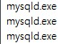

# 22년 11월 1일

## MySQL 오류 해결

### 오류 이전 상황
3306포트에 비밀번호를 까먹어서 5.7의 MySQL 버전도 업그레이드할 겸해서 MySQL을 밀고 8.0버전으로 재설치했다. 

그리고 정상적으로 11월 2일에 설치해서 11월 6일까지 사용하다가 오늘보니 접근이 안된다.


<br>
<br>

## 해결과정

일단 cmd로 접근해본다.

보니까 환경변수가 설정되어 있지않아서 mysql 명령어가 먹지 않는다.

다음과 같이 Path에 환경 변수로 추가해준다.
```
C:\Program Files\MySQL\MySQL Server 8.0\bin
```

그 후 cmd에서 로그인해본다.
```
mysql -u root -p

--비밀번호 따로 입력

-- 이전에 생성한 DB인 InhaTcES 사용
use InhaTcES;
-- 생성되어 있는 테이블 조회
show tables;
```

현재 MySQL 자체는 cmd에서는 정상적으로 접근할 수 있다.

<br>
<br>

다음과 같이 포트와 ip를 지정해서 접근해봤다.

```
mysql -u root -p -h 127.0.0.1 -P 3306 

-- 비밀번호는 아까와 같은 비밀번호 입력

-- 에러발생
ERROR 1045 (28000): Access denied for user 'root'@'localhost' (using password: YES)
```

<br>

비밀번호가 다르다는 것 같은데, 이전에 `mysql -u root -p`로 접근할 때와 같은 비밀번호를 사용했다. 다시 `mysql -u root -p`로 접근해서 혹시 포트가 다른가해서 포트를 확인해 봤다.

```
mysql -u root -p

-- 포트 확인
show global variables like 'PORT'

--3306으로 확인
```
포트는 이상이 없는듯 하다.

<br>

bind-address를 설정해주어봤다.
```
C:\ProgramData\MySQL\MySQL Server 8.0로 이동

my.ini 열기 
- 관리자 권한으로 실행을 해야한다.
 - 메모장으로 열고 싶다면 관리자권한으로 메모장을 열고 우측 상단 열기로 열자

다음 설정을 추가
bind-address=127.0.0.1
```
설정을하고 서비스에서 mysql을 다시시작해도 똑같이 접근이 안된다.

<br>
<br>

### 해결

```
window키 + R 누르기
resmon.exe 입력
확인
```
위와 같은 명령어로 리소스모니터에 들어가서 mysql포트를 확인해봤는데 여러개가 떠있었다.



<br>

혹시나해서 작업관리자로 들어가서 다시 확인을 해봤다.


<br>

위와 같이 MySQL이 여러개가 실행되는 것을 확인했다. 해당 exe의 파일 폴더로 들어가보니 다음과 같았다.
```
 Bitnami
C:\Bitnami\wampstack-8.0.2-0/...
 내가 설치한 MySQL
C:\Program Files\MySQL\MySQL Server 8.0/...
```

해당 Bitnami의 mysql 설정파일인 `my.ini`을 확인해 봤는데 3306포트를 사용하는 것을 확인했다.

<br>

일단 포트를 3307로 포트를 변경하고 Workbench를 실행했다.
```
C:\Bitnami\wampstack-8.0.2-0\mysql\my.ini 내용 중 일부

...

port=3307

...
```

<br>

Workbench 정상작동을 확인했다.<br>
원인은 두가지 MySQL이 같은 포트를 사용하면서 발생한 것 같다.<br>
충돌이 바로 나지 않고 약 일주일을 어떻게 쓴건지 의문이다.

<br>
<br>

### reference

https://dhan-description.tistory.com/84

https://stackoverflow.com/questions/7864276/cannot-connect-to-database-server-mysql-workbench/73968917#73968917

https://velog.io/@mong-head/MySQL-Port-%EC%B6%A9%EB%8F%8C-%EB%AC%B8%EC%A0%9C-%ED%95%B4%EA%B2%B0


