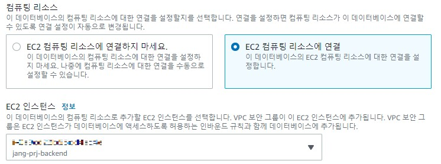

# 22년 09월 18일


## aws를 이용한 Springboot 프로젝트 배포 4

### RDS DB 생성

[[RDS] AWS RDS MySQL 프리티어 생성](https://dev-elena-k.tistory.com/12)과 [[AWS] 💰 프리티어 요금 폭탄 방지 💸 무료 사용량 정리](https://inpa.tistory.com/entry/AWS-%F0%9F%92%B0-%ED%94%84%EB%A6%AC%ED%8B%B0%EC%96%B4-%EC%9A%94%EA%B8%88-%ED%8F%AD%ED%83%84-%EB%B0%A9%EC%A7%80-%F0%9F%92%B8-%EB%AC%B4%EB%A3%8C-%EC%82%AC%EC%9A%A9%EB%9F%89-%EC%A0%95%EB%A6%AC#RDS) 의 RDS 부분 참고해서 RDS 인스턴스를 생성했다.

<br>

이때 나는 ec2와 연결해서 사용할 것이기 때문에 다음과 같이 생성할 때 연결을 설정해주었다.

<p align="center"></p>

<br>
<br>

### RDS 운영환경에 맞는 파라미터 설정

[AWS-데이터베이스-환경-구축](https://velog.io/@swchoi0329/AWS-%EB%8D%B0%EC%9D%B4%ED%84%B0%EB%B2%A0%EC%9D%B4%EC%8A%A4-%ED%99%98%EA%B2%BD-%EA%B5%AC%EC%B6%95)에 RDS 운영환경에 맞는 파라미터 설정 부분 참고


<br>
<br>

### RDS EC2 연결
[EC2에서 RDS 접근하기](https://codesyun.tistory.com/303)에 `EC2에 MySQL CLI 설치`부분부터 보면 된다. 위에서 EC2 컴퓨팅 리소스의 연결 옵션을 선택해서 보안 그룹을 따로 설정할 필요가 없다.

```
 mysql 설치
sudo yum install mysql

 EC2에서 RDS 접근
mysql -u 계정 -p -h 엔드포인트
mysql -u root -p -h ~~~
```

이제 비밀번호를 입력하고 접속하면 된다.
```
 db 테이블 확인
show databases;
```

<br>
<br>

### RDS 로컬 접속

지속적으로 RDS에 접속이 불가능해서 일단 여기서 멈췄다. 계속 타임아웃이 나오는 걸 보니까 보안 그룹 문제인거 같은데 이상하게 내 ip를 인바운드 규칙으로 적용해도 안되서 일단 여기까지 한다.